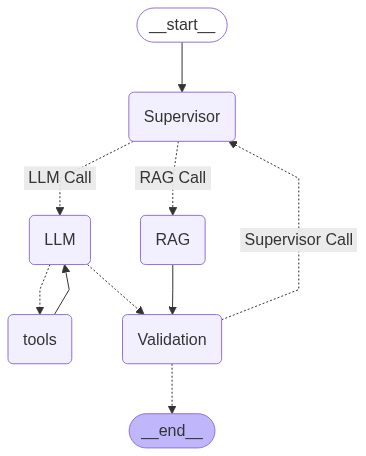

## Architecture

The agent's workflow is orchestrated using LangGraph, defining a state machine with the following key nodes:

1.  **Supervisor:** Analyzes the incoming user query and determines if it's "Related" to LLM/Transformer concepts (requiring RAG) or "Not Related" (can be handled by a general LLM with tools).
2.  **RAG:**
    * Retrieves relevant text and image chunks from the pre-processed document store based on the user's query.
    * Constructs a multi-modal prompt incorporating both text context and image descriptions.
    * Generates an answer using `gpt-4o-mini`.
3.  **LLM:**
    * For "Not Related" queries, directly interacts with `gpt-4o-mini`.
    * Can invoke external tools (currently Tavily Search) to gather real-time or broader information if needed.
4.  **Tools:** Executes any tool calls made by the `LLM` node (e.g., Tavily Search).
5.  **Validation:** Evaluates the generated response (from either RAG or LLM) against the original query to determine if it's a "pass" (adequate answer) or "fail" (irrelevant, incomplete, etc.).
6.  **Router Nodes:** Direct the flow of the graph based on the output of the Supervisor, LLM (for tool calls), and Validation nodes.



## Setup and Installation


## Setup

1.  **Clone the Repository:**
    
    git clone [<https://github.com/theserenecoder/AI_Projects.git>](https://github.com/theserenecoder/AI_Projects.git)
    

2.  **Create a Virtual Environment:**
    ```bash
    python -m venv venv
    source venv/Scripts/activate  # On Windows
    # source venv/bin/activate    # On macOS/Linux
    ```

3.  **Install Python Dependencies:**
    ```bash
    pip install -r requirements.txt
    # (Ensure requirements.txt contains: unstructured, langchain-unstructured[local], langchain-astradb, pypdf, python-dotenv, etc.)
    ```
    If you don't have a `requirements.txt`, you can install manually:
    ```bash
    pip install unstructured langchain-unstructured[local] langchain-astradb pypdf python-dotenv
    ```

4.  **Install External Dependencies:**
    * **Poppler:** Required by `unstructured` for PDF processing.
        * Download from [https://github.com/oschwartz10612/poppler-windows/releases](https://github.com/oschwartz10612/poppler-windows/releases) (for Windows).
        * Extract and add the `bin` directory to your system's `PATH`.
    * **Tesseract OCR:** Required by `unstructured` for image OCR.
        * Download from [https://github.com/UB-Mannheim/tesseract/wiki](https://github.com/UB-Mannheim/tesseract/wiki) (for Windows).
        * Install and add the installation directory (e.g., `C:\Program Files\Tesseract-OCR`) to your system's `PATH`.

5.  **Set up AstraDB:**
    * Create an AstraDB instance and a database.
    * Obtain your AstraDB API Endpoint and Application Token.
    * Set these as environment variables (e.g., in a `.env` file):
        ```
        ASTRA_DB_API_ENDPOINT="your_api_endpoint"
        ASTRA_DB_APPLICATION_TOKEN="your_application_token"
        ASTRA_DB_KEYSPACE="your_keyspace" # Optional
        OPENAI_API_KEY="your_openai_api_key" # If using OpenAI embeddings/LLMs
        ```
