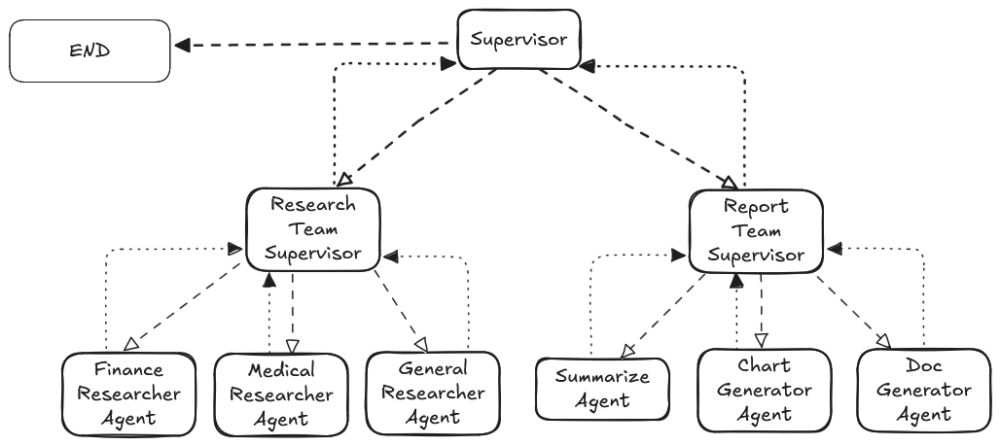
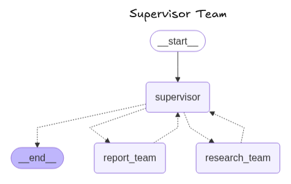
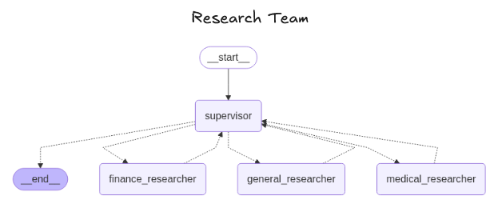
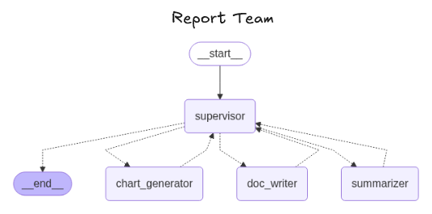

# 🤖 AI Agent Orchestration System for Research and Reporting
This project implements a sophisticated AI agent orchestration system using LangGraph, designed to automate the process of researching user queries, formatting the findings into structured documents, and optionally generating charts. It leverages specialized AI agents working collaboratively under a central supervisor to deliver comprehensive reports.

# ✨ Features
Intelligent Delegation: A Head Supervisor agent intelligently routes user queries to the appropriate specialized teams.

## 🧪Specialized Research:

- **General Researcher**: Conducts broad web searches using Tavily.

- **Financial Researcher**: Gathers financial news (Yahoo Finance) and retrieves stock prices (yfinance), capable of inferring stock tickers from company names.

- **Medical Researcher**: Accesses medical literature via PubMed and general web search.

## 📄Automated Document Generation:

- **Sumarrizer & Formatter Agent**: Transforms raw research output into a well-structured and readable Markdown document.

- **Document Writer Agent**: Saves the formatted document to a file, intelligently choosing a descriptive filename based on the content.

## 📊Dynamic Chart Generation (Optional): 
A Chart Generator agent can create and execute Python code (e.g., using Matplotlib) to generate charts based on document data.

## 🧩Modular & Extensible: 
Built with LangGraph, allowing for easy expansion with new agents, tools, and workflows.

# 🚀 Architecture
The system is built as a LangGraph StateGraph, orchestrating the flow between different specialized AI agents.




 




# Agent Roles:
- **Head Supervisor**: The central orchestrator. It receives user queries and delegates tasks to either the Research Team or the Report Team based on the query's nature and the current workflow state.

- **Research Team (Conceptual Node/Subgraph)**: This represents the collective intelligence for information gathering. In a full implementation, it contain a sub-supervisor that routes to:

    - **General Researcher**: Uses TavilySearchResults for general web queries.

    - **Medical Researcher**: Uses PubMedRetriever and TavilySearchResults for medical-specific inquiries.

    - **Finance Researcher**: Uses YahooFinanceNewsTool and get_stock_price (yfinance) for financial analysis.

- **Report Team (Conceptual Node/Subgraph)**: The represents the collective intellegence for information gathering. In a full implementation, it contain a sub-supervisor that routes to:

    - **Summarizer & Formatter Agent**: Takes the raw output from the Research Team and structures it into a clean, readable Markdown document.

    - **Document Writer Agent**: Receives the formatted Markdown content from the Formatter and saves it to a file, dynamically choosing a relevant filename.

    - **Chart Generator Agent**: If requested, this agent can read data (e.g., from the generated document) and use a Python REPL to generate and potentially save charts.

# ⚙️ Setup

#### Clone the repository:
```bash
git clone https://github.com/theserenecoder/AI_Projects.git
cd AI_Projects  
```

#### Create a virtual environment (recommended):
```bash
python -m venv venv
source venv/bin/activate  # On Windows: `venv\Scripts\activate`
```

#### Install dependencies:
```bash
pip install -r requirements.txt
```

(You'll need to create a requirements.txt based on your imports, e.g., langchain-openai, langchain-community, langchain-groq, langgraph, langchain-experimental, yfinance, pydantic).

A basic requirements.txt would look like:
```
langchain-openai
langchain-community
langchain-groq
langgraph
langchain-experimental
yfinance
pydantic
tavily-python # if using TavilySearchResults
pubmed_retriever # if using PubMedRetriever
```
#### Set up API Keys:
Create a .env file in the root directory of your project and add your API keys:
```
OPENAI_API_KEY="your_openai_api_key"
GROQ_API_KEY="your_groq_api_key"
TAVILY_API_KEY="your_tavily_api_key" # Only if you're using Tavily for general search
```

Make sure to replace "your_..." with your actual keys.


The script will then stream the execution steps of the agents. You can modify the message variable in the example usage section of your script to test different queries.

### Example Queries:

- message = [HumanMessage(content="Explain the current stock performance of Google, and provide recent news impacting it.")]

- message = [HumanMessage(content="What are the latest advancements in CRISPR technology?")]

- message = [HumanMessage(content="Summarize the history of the internet.")]

- message = [HumanMessage(content="What are the symptoms and treatments for Type 2 Diabetes?")]

After execution, check the outputfiles directory for the generated Markdown document (e.g., stock_performance_report.md, google_stock_analysis.md, etc.).

# 🚧 Future Enhancements
- **DOCX/PDF Output**: Implement a dedicated docx_converter_tool using python-docx to generate rich .docx files with embedded charts.

- **Chart Embedding**: Enhance the Chart Generator and Document Writer to embed generated charts directly into the final document (for .docx or by creating a more sophisticated Markdown rendering pipeline).

- **Iterative Refinement**: Allow agents to ask clarifying questions or suggest further research/reporting steps.

- **Human-in-the-Loop**: Introduce points where a human can review or approve agent decisions or outputs.

- **Error Handling & Retries**: More robust error handling for API calls and tool executions.

- **User Interface**: Build a simple web UI to interact with the agent system.

- **Hosting on AWS**: Deploying the agent system on Amazon Web Services (AWS) for scalable and robust cloud-based operation